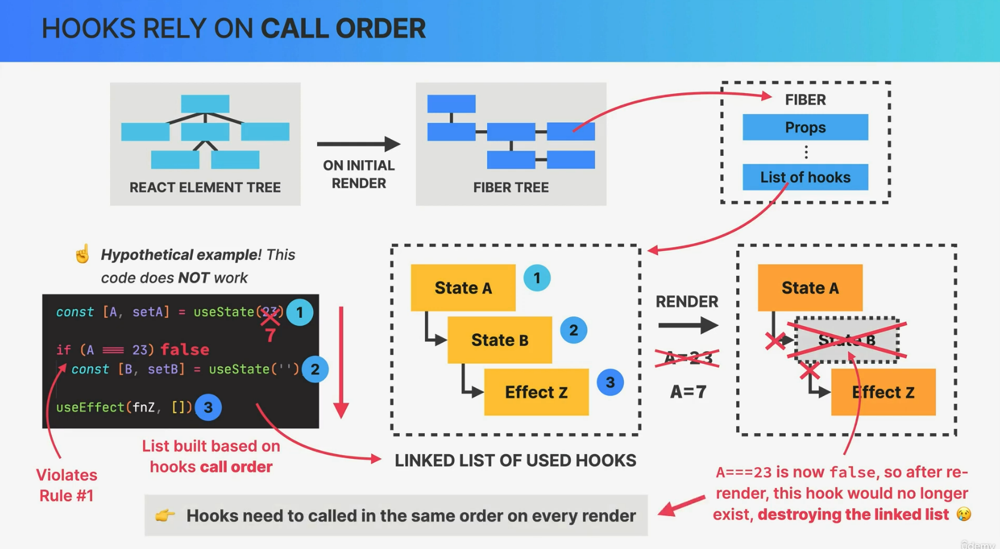

# How to Think About Components

### 1. How to Think About Components:

In React, components are the building blocks of your user interface. They encapsulate a piece of the user interface, which can include both structure and behavior. Here's how to think about components:

- **Modularity**: Break your UI into smaller, self-contained components. Each component should ideally have a single responsibility. This makes your code easier to understand, maintain, and reuse.

- **Hierarchy**: Visualize your UI as a tree of components, with a single root component (usually your main application component) at the top. Components can have parent-child relationships, and data can flow from top (parent) to bottom (child) through props.

- **Reusability**: Aim for reusable components that can be used in multiple parts of your application. Well-designed components should be versatile and not tightly coupled to a specific context.

- **Data Flow**: Understand how data flows through your components. Parent components can pass data (props) to child components, and child components can communicate with their parent components through callback functions.

- **State Management**: Decide where to store and manage component-specific state. Use the `useState` hook (or state in class components) for local state and consider state management libraries like Redux for global state.

### 2. Composition:

Composition is a key concept in React and revolves around combining simple components to build more complex ones. Here's how it works:

- **Component Composition**: You can create new components by composing existing ones. This is often done by nesting components inside one another. For example, you can compose a complex form by combining smaller input, button, and label components.

- **Reusable Building Blocks**: Think of components as building blocks that you can reuse throughout your application. This reduces redundancy and makes your codebase more maintainable.

- **Props Passing**: Use props to pass data and functions between components. Child components can receive data from parent components and trigger actions in parent components through callbacks.

### 3. Reusability:

Reusability is a fundamental principle in React development. Here's how you can ensure components are reusable:

- **Component Independence**: Make components independent of their context as much as possible. Avoid hardcoding data or styles that are specific to a particular use case.

- **Props and Prop Types**: Design components to accept props for customization. Use prop types or TypeScript to specify the expected props and their types, which can help catch errors and make components more predictable.

- **Functional Components**: Prefer functional components over class components when possible. Functional components are typically more concise and easier to reuse.

- **Component Libraries**: Consider creating a library of reusable components that can be shared across multiple projects or teams.

### 4. How to Split a Component:

Breaking down a component into smaller parts is essential for code organization and maintainability. Here's how to split a component:

- **Identify Responsibilities**: Analyze the component's code and identify distinct responsibilities or sections. Each section could potentially become a new component.

- **Create New Components**: Extract the identified sections into separate components. These can be either functional components or class components.

- **Pass Data via Props**: If the extracted components need access to data, pass that data as props from the parent component. This way, you maintain a unidirectional flow of data.

- **Recompose**: In the parent component, replace the extracted sections with the new components you created. Make sure to pass the necessary data and callbacks via props.

### 5. Building Layouts:

Layouts are the foundation of your application's user interface. Here's how to approach building layouts in React:

- **Container and Content Components**: Divide your layout into container components (e.g., header, sidebar, main content) and content components (e.g., individual sections, cards, forms).

- **Flexbox and CSS Grid**: Use CSS Flexbox and CSS Grid to create responsive and flexible layouts. These CSS techniques allow you to create complex layouts with ease.

- **Responsive Design**: Make your layouts responsive by using media queries and adjusting component behavior based on screen size.

- **Component Libraries**: Consider using UI component libraries like Material-UI or Bootstrap to speed up the layout design process. These libraries provide pre-designed layout components.

- **Separation of Concerns**: Keep your layout components separate from your business logic. Layout components should primarily handle the presentation and structure of your UI.

- **Component Composition**: Compose your layout by combining smaller, reusable components. This modular approach makes it easier to update and maintain your layout.

In summary, thinking in components, practicing composition and reusability, effectively splitting components, and building flexible layouts are key principles in React development that can lead to more organized, maintainable, and responsive user interfaces.

## stateless/presentational components, stateful components, structural components

1. **Stateless/Presentational Components (Functional Components)**:

   - **Purpose**: Stateless components, also known as presentational components, focus solely on rendering UI elements and presenting data to the user. They are often referred to as "dumb" components because they don't manage their own state or handle complex logic.

   - **Characteristics**:

     - Typically implemented as functional components.
     - Receive data through props.
     - Do not have internal state.
     - Focus on UI rendering and structure.
     - Reusable and easy to test.

   - **Use Cases**: Stateless components are used for rendering static or UI-heavy parts of your application, such as buttons, forms, headers, and other UI elements. They are purely responsible for displaying data and user interfaces.

2. **Stateful Components (Class Components or Functional Components with Hooks)**:

   - **Purpose**: Stateful components, also known as container components or smart components, manage data, state, and business logic. They orchestrate the behavior of child components and handle data fetching and state updates.

   - **Characteristics**:

     - Can be implemented as class components or functional components with hooks like `useState` and `useEffect`.
     - Maintain internal state using `this.state` (for class components) or `useState` and `useReducer` (for functional components).
     - Handle data fetching, API calls, and state updates.
     - Pass data and event handlers as props to child components.

   - **Use Cases**: Stateful components are used when you need to manage and update the state of your application, handle user interactions, and coordinate the behavior of multiple child components. They serve as the bridge between data and UI.

3. **Structural Components**:

   - **Purpose**: Structural components, also known as layout or structural components, are responsible for defining the overall structure and layout of your user interface. They organize how other components are arranged on the screen.

   - **Characteristics**:

     - Typically implemented as functional components.
     - Focus on the layout and structure of the UI.
     - May use CSS Grid, Flexbox, or other layout techniques.
     - Often include placeholders for child components.

   - **Use Cases**: Structural components are used to create consistent layouts for your application. They define the placement of header, footer, sidebar, main content, and other structural elements. They provide a foundation for arranging and positioning other components.

These component types help organize your React application by separating concerns and responsibilities. Stateless components handle presentation and UI rendering, stateful components manage data and logic, and structural components define the layout and structure of the user interface. By breaking down your application into these categories, you can create a more maintainable and modular codebase.

## Prop drilling

**Prop drilling**, also known as **prop passing**, is a common challenge in React when data or functions need to be passed down through multiple levels of nested components. It occurs when you have a component deep in the component tree that needs access to a prop, but that prop must be passed through several intermediary components that don't directly use it. This can lead to less maintainable and more error-prone code.

Here's a simple example to illustrate prop drilling:

```jsx
function App() {
  const data = "Hello, Prop Drilling!";

  return (
    <div>
      <Header data={data} />
      <Main data={data} />
      <Footer data={data} />
    </div>
  );
}

function Header({ data }) {
  return <header>{data}</header>;
}

function Main({ data }) {
  return <main>{data}</main>;
}

function Footer({ data }) {
  return <footer>{data}</footer>;
}
```

In this example, the `data` prop needs to be passed from the `App` component down to the `Header`, `Main`, and `Footer` components. If you have a large component tree with multiple levels of nesting, this can become unwieldy, especially when you need to pass multiple props or functions.

To mitigate prop drilling, there are several approaches you can consider:

1. **Context API**: React's Context API allows you to create a global state that can be accessed by any component in the tree without explicit prop passing. It's particularly useful for shared data and settings that many components need.

2. **Redux**: Redux is a popular state management library for React that centralizes application state and eliminates the need for prop drilling. It provides a store where data can be accessed and updated from any component.

3. **React Query**: React Query is a library for managing, caching, and synchronizing data in your application. It can help reduce the need for prop drilling when dealing with data fetching and management.

4. **Custom Hooks**: You can create custom hooks to encapsulate and share logic across components, reducing the need to pass props explicitly. Custom hooks can manage state and provide reusable functions.

5. **Higher-Order Components (HOCs)**: You can use HOCs to wrap components and inject props or functions as needed. While HOCs can sometimes make the code more complex, they can be a useful tool for solving prop drilling issues.

6. **Render Props**: Render props is a pattern where a component takes a function as a prop and calls it to render part of its UI. This can help with prop drilling by allowing you to pass data and functions directly to child components.

Each of these approaches has its strengths and use cases, and the choice depends on the complexity and requirements of your application. By using one or a combination of these techniques, you can minimize prop drilling and make your React codebase more maintainable and efficient.

## Props as a Component API

**Props as a Component API** refers to the practice of using props (short for properties) to define and configure the behavior and appearance of React components. In React, components can accept props as input, which allows them to be highly customizable and reusable.

Here's a breakdown of how props serve as a component API:

1. **Customization**: Props enable you to customize the behavior and appearance of a component. When you render a component, you can pass various props to control its behavior and appearance.

2. **Data Flow**: Props create a unidirectional data flow in React. Data flows from parent components to child components through props. This makes it easy to pass data down the component tree and maintain a clear flow of information.

3. **Reusability**: Props promote component reusability. By configuring components with different sets of props, you can reuse the same component in various parts of your application, adapting it to different requirements.

4. **Composition**: You can compose complex UIs by combining multiple components and passing props between them. This allows you to create component hierarchies that represent your application's structure.

Here's an example to illustrate props as a component API:

```jsx
function Button(props) {
  return (
    <button
      style={{
        backgroundColor: props.backgroundColor,
        color: props.textColor,
      }}
      onClick={props.onClick}
    >
      {props.label}
    </button>
  );
}

function App() {
  return (
    <div>
      <Button
        backgroundColor="blue"
        textColor="white"
        label="Click me"
        onClick={() => alert("Button clicked!")}
      />
    </div>
  );
}
```

In this example, the `Button` component accepts props like `backgroundColor`, `textColor`, `label`, and `onClick`. These props determine how the button looks and behaves. When `Button` is used in the `App` component, it's customized by passing specific prop values.

Overall, props serve as a versatile and flexible way to define the API of a React component, allowing you to create customizable and reusable UI elements in your applications. They play a central role in React's component-based architecture.

## The Component Lifecycle


The React component lifecycle refers to a series of events and methods that a React component goes through during its existence, from creation to removal. Understanding the component lifecycle is crucial for managing state, handling side effects, and optimizing the performance of your React applications.

In React, the component lifecycle is divided into three main phases:

1. **Mounting**:

   - This phase corresponds to the moment when a component is created and inserted into the DOM. There are three key lifecycle methods in the mounting phase:
     - `constructor()`: This is the constructor method where you can initialize state and bind event handlers.
     - `render()`: The `render` method is responsible for rendering the component's UI based on its current state and props. It is a required method in every React component.
     - `componentDidMount()`: This method is called after the component has been rendered to the DOM. It is often used for actions such as data fetching, setting up subscriptions, or interacting with the DOM.

2. **Updating**:

   - The updating phase occurs when a component's state or props change, causing it to re-render. There are several lifecycle methods associated with this phase:
     - `shouldComponentUpdate(nextProps, nextState)`: This method is called before rendering and allows you to control whether the component should update. You can implement custom logic to optimize rendering.
     - `render()`: As mentioned earlier, the `render` method is responsible for rendering the component's UI.
     - `componentDidUpdate(prevProps, prevState)`: This method is called after the component has re-rendered. It is commonly used for post-update actions, such as updating the DOM in response to state changes.

3. **Unmounting**:
   - The unmounting phase occurs when a component is removed from the DOM. There is one key lifecycle method associated with this phase:
     - `componentWillUnmount()`: This method is called just before a component is removed from the DOM. It is used for cleaning up resources, such as unsubscribing from event listeners or timers, to prevent memory leaks.

In addition to these main lifecycle methods, React introduced a set of new lifecycle methods in React 16.3 and later. These new methods are considered safer and more predictable than some of the older methods. They include:

- `static getDerivedStateFromProps(nextProps, prevState)`: This static method is used to update the component's state based on changes in props. It runs before `render` and is not tied to component instances, making it a safer alternative to `componentWillReceiveProps`.

- `getSnapshotBeforeUpdate(prevProps, prevState)`: This method is called right before the most recent render result is committed to the DOM. It can capture information from the DOM before potential changes and return it, often used in conjunction with `componentDidUpdate`.

React 18 introduced asynchronous rendering, which further optimizes the component lifecycle by allowing React to batch updates and prioritize rendering based on the current rendering mode (e.g., user interactions or background updates).

In summary, understanding the React component lifecycle and the associated methods is essential for managing the behavior and performance of your components. It helps you control side effects, optimize rendering, and build robust React applications.

## useEffect


`useEffect` is a critical hook in React that allows you to perform side effects in your functional components. Side effects include data fetching, setting up subscriptions, manually changing the DOM, and more. Here's an overview of `useEffect`:

**What `useEffect` Does**:

- `useEffect` enables you to handle side effects in your components by specifying functions that should be executed after the component renders.
- It serves as a replacement for lifecycle methods like `componentDidMount`, `componentDidUpdate`, and `componentWillUnmount` in class components.

**When to Use `useEffect`**:

- Use `useEffect` when you need to perform side effects after rendering. Common scenarios include:
  - Fetching data from an API.
  - Subscribing to external data sources, such as WebSockets.
  - Manually changing the DOM, like updating the title of a webpage.
  - Synchronizing state or subscriptions with external libraries.

**Syntax**:

```jsx
useEffect(() => {
  // Code for the side effect goes here
}, [dependencies]);
```

- The first argument is a function that contains the code for your side effect.
- The second argument is an optional array of dependencies. When any of these dependencies change, the effect function is re-run. If omitted, the effect runs after every render.

**Common Best Practices**:

1. **Always Specify Dependencies**: If you omit the second argument (dependencies array), the effect will run after every render. To avoid unnecessary re-renders, specify dependencies that the effect relies on. This is an important optimization.

   ```jsx
   useEffect(() => {
     // Effect code
   }, [dependency1, dependency2]);
   ```

2. **Cleanup**: If your effect requires cleanup (e.g., unsubscribing from a subscription or clearing timeouts/intervals), return a cleanup function from the effect.

   ```jsx
   useEffect(() => {
     const subscription = subscribeToData();

     return () => {
       // Cleanup code (unsubscribe, clear timers, etc.)
       subscription.unsubscribe();
     };
   }, [dependency]);
   ```

3. **Avoid Infinite Loops**: Be cautious when using `useEffect` to update state inside the effect because it can lead to infinite loops. Use the dependencies array to control when the effect should run.

   ```jsx
   useEffect(() => {
     // This will create an infinite loop if not handled properly
     setState(newValue);
   }, [newValue]); // Be careful with newValue here
   ```

4. **Multiple Effects**: You can use multiple `useEffect` hooks in a single component to separate concerns and keep the code clean.

   ```jsx
   useEffect(() => {
     // Effect 1
   }, [dependency1]);

   useEffect(() => {
     // Effect 2
   }, [dependency2]);
   ```

5. **Async Effects**: If your effect contains asynchronous code (e.g., fetching data with `async/await`), you can mark the effect as `async`. However, be cautious about handling errors.

   ```jsx
   useEffect(() => {
     async function fetchData() {
       try {
         const response = await fetch("https://api.example.com/data");
         const data = await response.json();
         setData(data);
       } catch (error) {
         console.error("Error fetching data:", error);
       }
     }
     fetchData();
   }, []);
   ```

`useEffect` is a versatile and powerful hook in React, but it should be used thoughtfully and with an understanding of how it affects component rendering and performance. Properly managing side effects and dependencies can lead to efficient and maintainable React components.

## event handler vs effects

Event handlers and effects are both essential concepts in React, but they serve different purposes and are used in different scenarios within your components.

**Event Handlers**:

1. **Purpose**: Event handlers are functions that are called in response to user interactions or other events, such as a button click, input change, or mouseover.
2. **Usage**: Event handlers are typically used to handle user input and trigger actions within your components. For example, you might use an event handler to update the component's state or perform some other logic when a button is clicked.
3. **Lifecycle**: Event handlers do not have a specific lifecycle associated with them. They are called directly in response to events and execute immediately.
4. **Syntax**: Event handlers are defined as functions and attached to JSX elements using event props (e.g., `onClick`, `onChange`).

**Example**:

```jsx
function MyComponent() {
  const handleClick = () => {
    // Handle the button click event
  };

  return <button onClick={handleClick}>Click Me</button>;
}
```

**Effects (useEffect)**:

1. **Purpose**: Effects are functions that allow you to perform side effects in your functional components, such as data fetching, DOM manipulation, or subscription setup.
2. **Usage**: Effects are used when you need to perform tasks that are not directly related to user interactions but are related to the component's lifecycle or other asynchronous operations.
3. **Lifecycle**: Effects are part of the component lifecycle and are called after the component has rendered (or re-rendered). You can control when effects run by specifying dependencies.
4. **Syntax**: Effects are created using the `useEffect` hook and are typically defined inside functional components.

**Example**:

```jsx
import { useEffect, useState } from "react";

function MyComponent() {
  const [data, setData] = useState(null);

  useEffect(() => {
    // Fetch data when the component mounts
    fetch("https://api.example.com/data")
      .then((response) => response.json())
      .then((data) => setData(data))
      .catch((error) => console.error("Error fetching data:", error));
  }, []); // Empty dependency array means the effect runs once after the initial render

  return <div>{data ? <p>Data: {data}</p> : <p>Loading...</p>}</div>;
}
```

In summary, event handlers are used to respond to user interactions and events, while effects are used to manage side effects, perform asynchronous operations, and interact with the component lifecycle. Both are important for building dynamic and interactive React applications, and they serve complementary roles in managing different aspects of your components.

## The useEffect Dependency Array


The dependency array in the `useEffect` hook is an optional second argument that allows you to specify dependencies for the effect. It plays a crucial role in determining when the effect should run and is a powerful tool for optimizing and controlling the behavior of your React components. Here's how the dependency array works and how to use it effectively:

**Syntax**:

```jsx
useEffect(() => {
  // Effect code
}, [dependency1, dependency2, ...]);
```

- The second argument of `useEffect` is an array of dependencies, which is a list of variables or values that the effect depends on.

**How the Dependency Array Works**:

- When the component renders, React compares the current values of the dependencies with their previous values (from the previous render).
- If any dependency value has changed between renders, React will execute the effect function. If none of the dependencies have changed, React will skip the effect.

**Common Use Cases for the Dependency Array**:

1. **Running the Effect Once**: To run an effect only once, right after the initial render, provide an empty dependency array. This ensures that the effect runs once and doesn't re-run on subsequent renders.

   ```jsx
   useEffect(() => {
     // Effect code runs once
   }, []);
   ```

2. **Running the Effect When Dependencies Change**: If you want the effect to run whenever specific dependencies change, include those dependencies in the array. The effect will run when any of these dependencies have different values compared to the previous render.

   ```jsx
   const [count, setCount] = useState(0);

   useEffect(() => {
     // Effect code runs when count changes
     console.log(`Count changed to ${count}`);
   }, [count]);
   ```

3. **Cleaning Up Effects**: When you have cleanup logic in your effect (e.g., unsubscribing from a subscription), you should specify that dependency in the array. This ensures that the cleanup code runs when the component unmounts or when the dependency changes.

   ```jsx
   useEffect(() => {
     const subscription = subscribeToData();

     return () => {
       // Cleanup code (unsubscribe, clear timers, etc.)
       subscription.unsubscribe();
     };
   }, [dependency]);
   ```

**Tips for Using the Dependency Array Effectively**:

- Only include dependencies that are directly used within the effect. Avoid including unnecessary dependencies, as this can lead to unnecessary re-renders.
- Be cautious when using objects or arrays as dependencies, as React compares them by reference. If the reference does not change, the effect won't run, even if the content of the object or array changes. You may need to use the `useState` hook to create a new reference when the content changes.
- If you need to run cleanup logic when the component unmounts, specify that cleanup dependency in the array, or use the `return` statement to return a cleanup function.

The dependency array in `useEffect` is a powerful mechanism for controlling the behavior of your effects, optimizing performance, and ensuring that side effects are executed at the right time in your React components. Properly managing dependencies can lead to more efficient and predictable component behavior.

## Cleaning Up

Cleaning up in React components refers to the process of releasing resources, unsubscribing from external sources, or performing any necessary cleanup actions before a component is unmounted or before a new effect is executed. Proper cleanup is essential to prevent memory leaks and ensure that your application behaves correctly. React provides mechanisms to handle cleanup in functional components using the `useEffect` hook.

Here's how you can perform cleanup in React:

1. **Returning a Cleanup Function**:

   Inside an effect created with `useEffect`, you can return a function that will be executed when the component unmounts or when the dependencies specified in the dependency array change. This is the primary way to perform cleanup.

   ```jsx
   useEffect(() => {
     // Effect code
     return () => {
       // Cleanup code
     };
   }, [dependencies]);
   ```

   For example, you can use this pattern to unsubscribe from subscriptions, clear timers, or release resources.

   ```jsx
   useEffect(() => {
     const subscription = subscribeToData();

     return () => {
       // Cleanup: Unsubscribe from the subscription
       subscription.unsubscribe();
     };
   }, [dependency]);
   ```

   ```jsx
   import React, { useState, useEffect } from "react";

   function TimerComponent() {
     const [seconds, setSeconds] = useState(0);

     useEffect(() => {
       // Function to increment the timer every second
       const intervalId = setInterval(() => {
         setSeconds((prevSeconds) => prevSeconds + 1);
       }, 1000);

       // Cleanup function to clear the timer when the component unmounts
       return () => {
         clearInterval(intervalId);
       };
     }, []); // Empty dependency array for running the effect once

     return (
       <div>
         <p>Timer: {seconds} seconds</p>
       </div>
     );
   }

   export default TimerComponent;
   ```

2. **Cleanup on Unmount**:

   Returning a cleanup function from an effect ensures that it runs when the component unmounts. This is useful for cleaning up resources associated with the component.

   ```jsx
   import React, { useState, useEffect } from "react";

   function UnmountCleanupComponent() {
     const [visible, setVisible] = useState(true);

     useEffect(() => {
       // Effect for subscribing to a resource (e.g., WebSocket) when the component mounts
       const subscription = subscribeToResource();

       // Cleanup function to unsubscribe when the component unmounts
       return () => {
         subscription.unsubscribe();
       };
     }, []); // Empty dependency array for running the effect once on mount

     const toggleVisibility = () => {
       setVisible((prevVisible) => !prevVisible);
     };

     return (
       <div>
         <button onClick={toggleVisibility}>
           {visible ? "Hide Component" : "Show Component"}
         </button>
         {visible && <ResourceComponent />}
       </div>
     );
   }

   function ResourceComponent() {
     return <p>Resource Component</p>;
   }

   // Simulated subscription function
   function subscribeToResource() {
     // Simulate a subscription and return an object with an unsubscribe method
     const subscription = {
       unsubscribe: () => {
         console.log("Unsubscribed from resource");
         // Perform cleanup or unsubscribe logic here
       },
     };
     return subscription;
   }

   export default UnmountCleanupComponent;
   ```

3. **Cleanup on Dependency Change**:

   If you specify dependencies in the dependency array of `useEffect`, the effect will also run when any of those dependencies change. In this case, the cleanup function is executed before the effect runs again. This can be useful for cleanup before re-subscribing or resetting resources.

   ```jsx
   useEffect(() => {
     // Effect code
     return () => {
       // Cleanup code
     };
   }, [dependency1, dependency2]);
   ```

4. **Multiple Effects with Cleanup**:

   You can use multiple `useEffect` hooks in a single component, each with its cleanup logic. This allows you to organize cleanup code for different side effects separately.

   ```jsx
   useEffect(() => {
     // Effect 1 code
     return () => {
       // Cleanup for Effect 1
     };
   }, [dependency1]);

   useEffect(() => {
     // Effect 2 code
     return () => {
       // Cleanup for Effect 2
     };
   }, [dependency2]);
   ```

   ```jsx
   import React, { useState, useEffect } from "react";

   function MultiEffectComponent() {
     const [dataA, setDataA] = useState(null);
     const [dataB, setDataB] = useState(null);

     // Effect 1: Data fetching for dataA
     useEffect(() => {
       const abortController = new AbortController();

       const fetchDataA = async () => {
         try {
           const response = await fetch("https://api.example.com/dataA", {
             signal: abortController.signal, // Pass the AbortController's signal
           });
           const result = await response.json();
           setDataA(result);
         } catch (error) {
           console.error("Error fetching data A:", error);
         }
       };

       fetchDataA();

       // Cleanup for Effect 1: Cancel the data fetch if the component unmounts
       return () => {
         abortController.abort(); // Abort the fetch operation
       };
     }, []); // Empty dependency array for running Effect 1 once

     // Effect 2: Another data fetching for dataB
     useEffect(() => {
       const abortController = new AbortController();

       const fetchDataB = async () => {
         try {
           const response = await fetch("https://api.example.com/dataB", {
             signal: abortController.signal, // Pass the AbortController's signal
           });
           const result = await response.json();
           setDataB(result);
         } catch (error) {
           console.error("Error fetching data B:", error);
         }
       };

       fetchDataB();

       // Cleanup for Effect 2: Cancel the data fetch if the component unmounts
       return () => {
         abortController.abort(); // Abort the fetch operation
       };
     }, []); // Empty dependency array for running Effect 2 once

     return (
       <div>
         <p>Data A: {dataA}</p>
         <p>Data B: {dataB}</p>
       </div>
     );
   }

   export default MultiEffectComponent;
   ```

5. **Unmount Phase Cleanup**:

Cleanup functions run during the unmount phase when the component is removed from the DOM. This is an important step in preventing memory leaks and ensuring that resources are properly released.

```jsx
import React, { useState, useEffect } from "react";

function TimerComponent() {
  const [seconds, setSeconds] = useState(0);

  useEffect(() => {
    // Function to increment the timer every second
    const intervalId = setInterval(() => {
      setSeconds((prevSeconds) => prevSeconds + 1);
    }, 1000);

    // Cleanup function to clear the timer when the component unmounts
    return () => {
      clearInterval(intervalId);
    };
  }, []); // Empty dependency array for running the effect once

  return (
    <div>
      <p>Timer: {seconds} seconds</p>
    </div>
  );
}

export default TimerComponent;
```

6. **Error Handling**:

You can also include error-handling logic in your cleanup functions to handle unexpected errors that occur during cleanup.

```jsx
useEffect(() => {
  try {
    // Effect code
  } catch (error) {
    console.error("Error in effect:", error);
  }

  return () => {
    try {
      // Cleanup code
    } catch (error) {
      console.error("Error in cleanup:", error);
    }
  };
}, [dependency]);
```

Proper cleanup in React ensures that your components behave predictably, avoid memory leaks, and maintain a healthy application state. It's an important aspect of managing side effects in functional components and contributes to the overall stability and reliability of your React applications.

# react hooks and their rules





React hooks are functions that allow functional components to "hook into" React state and lifecycle features without the need for class components. They provide a way to manage state, side effects, and other React features in functional components. Here are some commonly used React hooks and their rules:

1. **useState**:

   - **Rule**: Call `useState` inside a functional component to declare a state variable.
   - **Usage**: It returns an array with the current state value and a function to update the state.

   ```jsx
   const [count, setCount] = useState(0);
   ```

2. **useEffect**:

   - **Rule**: Call `useEffect` inside a functional component to manage side effects and perform actions after the component renders.
   - **Usage**: It takes a function as its first argument, which contains the side effect code, and an optional dependency array as the second argument.

   ```jsx
   useEffect(() => {
     // Side effect code
   }, [dependencies]);
   ```

3. **useContext**:

   - **Rule**: Call `useContext` inside a functional component to access data from a context provider.
   - **Usage**: It takes a context object as its argument and returns the current context value.

   ```jsx
   const contextValue = useContext(MyContext);
   ```

4. **useReducer**:

   - **Rule**: Call `useReducer` inside a functional component to manage state with complex logic.
   - **Usage**: It returns the current state and a dispatch function to update the state based on actions.

   ```jsx
   const [state, dispatch] = useReducer(reducer, initialState);
   ```

5. **useRef**:

   - **Rule**: Call `useRef` inside a functional component to create mutable references to DOM elements or values that persist across renders.
   - **Usage**: It returns a `ref` object with a `current` property.

   ```jsx
   const myRef = useRef(initialValue);
   ```

6. **useMemo**:

   - **Rule**: Call `useMemo` inside a functional component to memoize expensive calculations.
   - **Usage**: It takes a function and an array of dependencies and returns a memoized value.

   ```jsx
   const memoizedValue = useMemo(() => computeExpensiveValue(a, b), [a, b]);
   ```

7. **useCallback**:

   - **Rule**: Call `useCallback` inside a functional component to memoize callback functions.
   - **Usage**: It takes a callback function and an array of dependencies and returns a memoized callback.

   ```jsx
   const memoizedCallback = useCallback(() => {
     // Function logic
   }, [dependencies]);
   ```

8. **Custom Hooks**:

   - **Rule**: Create custom hooks by starting the function name with "use" to reuse stateful logic across multiple components.
   - **Usage**: Custom hooks can encapsulate complex logic, state, or side effects, and they follow the same rules as regular hooks.

   ```jsx
   function useCustomHook() {
     // Custom hook logic
   }
   ```

**Rules for Using Hooks**:

1. Hooks should always be called at the top level of your functional component or custom hook. Don't call hooks inside loops, conditions, or nested functions.

2. Hooks should be called conditionally or in loops from the same component or custom hook to maintain consistent state.

3. Hooks should always be called in the same order within a component. This ensures that React can correctly associate state and effects with components.

4. Custom hooks should always start with the word "use" to differentiate them from regular functions and make it clear that they are hooks.

5. Only call hooks from functional components or other custom hooks, not from regular JavaScript functions.

6. You cannot use hooks in class components; they are specifically designed for functional components.

Following these rules and guidelines ensures that you use React hooks correctly and efficiently in your functional components, leading to more maintainable and predictable code.

# useState Summary


# Getting Started with Create React App

This project was bootstrapped with [Create React App](https://github.com/facebook/create-react-app).

## Available Scripts

In the project directory, you can run:

### `npm start`

Runs the app in the development mode.\
Open [http://localhost:3000](http://localhost:3000) to view it in your browser.

The page will reload when you make changes.\
You may also see any lint errors in the console.

### `npm test`

Launches the test runner in the interactive watch mode.\
See the section about [running tests](https://facebook.github.io/create-react-app/docs/running-tests) for more information.

### `npm run build`

Builds the app for production to the `build` folder.\
It correctly bundles React in production mode and optimizes the build for the best performance.

The build is minified and the filenames include the hashes.\
Your app is ready to be deployed!

See the section about [deployment](https://facebook.github.io/create-react-app/docs/deployment) for more information.

### `npm run eject`

**Note: this is a one-way operation. Once you `eject`, you can't go back!**

If you aren't satisfied with the build tool and configuration choices, you can `eject` at any time. This command will remove the single build dependency from your project.

Instead, it will copy all the configuration files and the transitive dependencies (webpack, Babel, ESLint, etc) right into your project so you have full control over them. All of the commands except `eject` will still work, but they will point to the copied scripts so you can tweak them. At this point you're on your own.

You don't have to ever use `eject`. The curated feature set is suitable for small and middle deployments, and you shouldn't feel obligated to use this feature. However we understand that this tool wouldn't be useful if you couldn't customize it when you are ready for it.

## Learn More

You can learn more in the [Create React App documentation](https://facebook.github.io/create-react-app/docs/getting-started).

To learn React, check out the [React documentation](https://reactjs.org/).

### Code Splitting

This section has moved here: [https://facebook.github.io/create-react-app/docs/code-splitting](https://facebook.github.io/create-react-app/docs/code-splitting)

### Analyzing the Bundle Size

This section has moved here: [https://facebook.github.io/create-react-app/docs/analyzing-the-bundle-size](https://facebook.github.io/create-react-app/docs/analyzing-the-bundle-size)

### Making a Progressive Web App

This section has moved here: [https://facebook.github.io/create-react-app/docs/making-a-progressive-web-app](https://facebook.github.io/create-react-app/docs/making-a-progressive-web-app)

### Advanced Configuration

This section has moved here: [https://facebook.github.io/create-react-app/docs/advanced-configuration](https://facebook.github.io/create-react-app/docs/advanced-configuration)

### Deployment

This section has moved here: [https://facebook.github.io/create-react-app/docs/deployment](https://facebook.github.io/create-react-app/docs/deployment)

### `npm run build` fails to minify

This section has moved here: [https://facebook.github.io/create-react-app/docs/troubleshooting#npm-run-build-fails-to-minify](https://facebook.github.io/create-react-app/docs/troubleshooting#npm-run-build-fails-to-minify)
